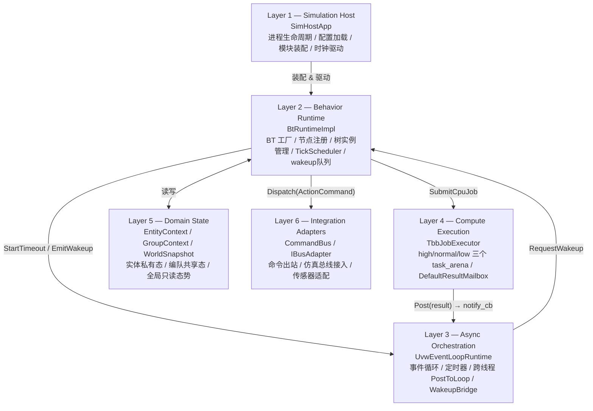
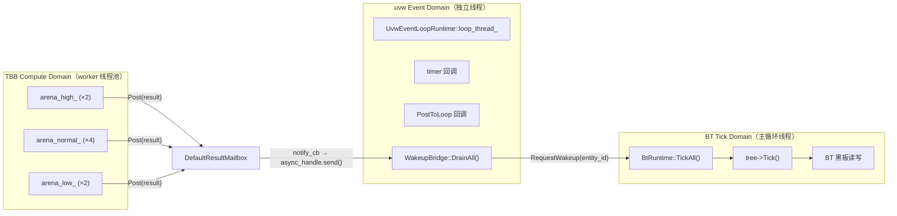
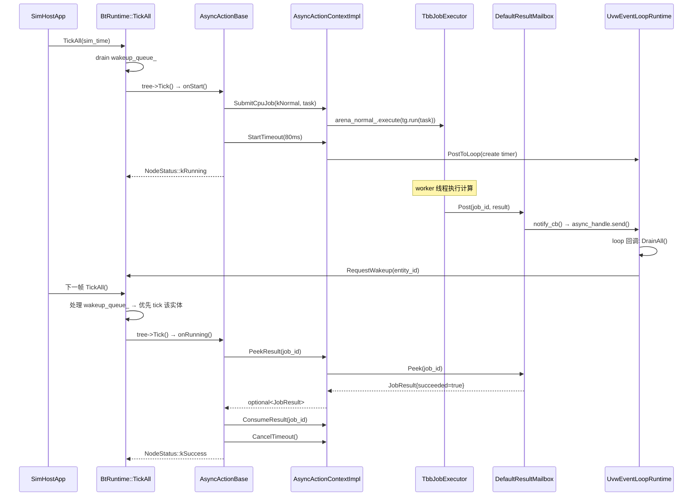
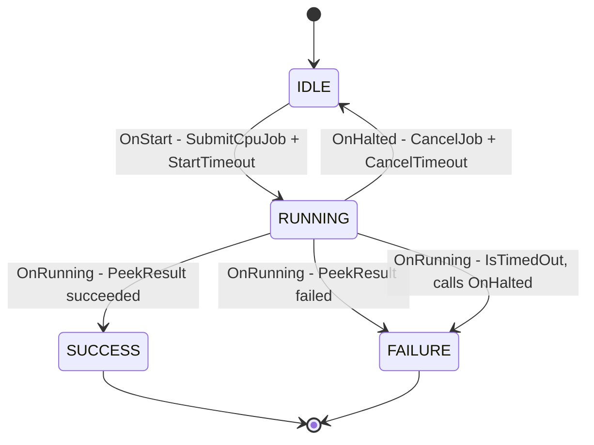
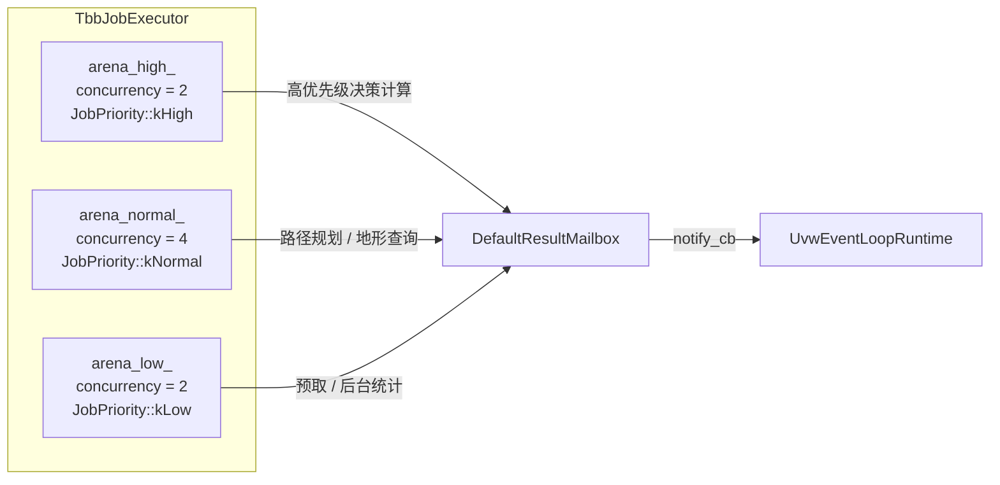
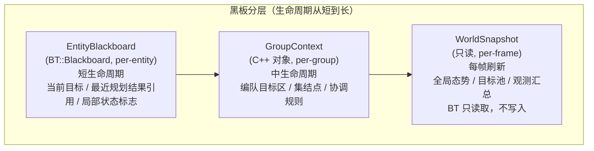
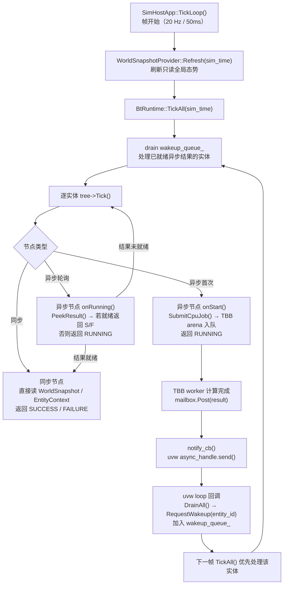

# sim-behavior 架构设计

## 1. 设计目标

- **行为树语义与执行分离**：BehaviorTree.CPP 负责"该做什么"，oneTBB 负责"谁来算"，uvw 负责"什么时候回来"
- **线程边界清晰**：三类执行域不允许跨域直接操作共享状态
- **BT 节点可单元测试**：节点只依赖接口 Facade（`IAsyncActionContext`），不直接持有 uvw/TBB 原始对象
- **跨平台 & 内网部署**：所有依赖从源码编译，zip 离线 vendor，不依赖系统安装包

---

## 2. 六层架构总览



---

## 3. 三类线程域



**跨域通信规则（强制）**：

| 来源域 | 目标域 | 允许的操作 |
|--------|--------|-----------|
| TBB Compute | Mailbox | `Post(result)` — 唯一出口 |
| Mailbox → uvw | uvw loop | `async_handle.send()` 唤醒 |
| uvw loop | BT Tick | `RequestWakeup(entity_id)` — 加入 wakeup 队列 |
| BT Tick | TBB | `SubmitCpuJob()` — 提交任务 |

**绝对禁止**：TBB worker 线程直接修改 BT 黑板、调用 `EntityContext::set*()`、调用 `BtRuntime::TickEntity()`。

---

## 4. 核心接口关系


---

## 5. Tick 机制深析

### 5.1 帧驱动：固定频率主循环

Tick 的唯一驱动源是 `SimHostApp::TickLoop()`，在**主线程**以固定 20 Hz（50 ms/帧）循环：

```cpp
// sim_host_app.cpp — TickLoop 核心逻辑
while (!stop_requested_) {
    auto frame_start = steady_clock::now();
    current_sim_time_ += 50;                      // 仿真时钟推进

    // snapshot_provider_->Refresh(current_sim_time_); // 刷新全局快照
    bt_runtime_->TickAll(current_sim_time_);       // ← 唯一触发点

    auto elapsed = steady_clock::now() - frame_start;
    sleep_for(50ms - elapsed);                    // 对齐到下一帧
}
```

> 整个 BT 执行域（节点读写黑板、调用 `OnStart/OnRunning/OnHalted`）都在这个主线程内串行发生，**没有任何并发**。

---

### 5.2 TickAll 的两阶段设计

`BtRuntimeImpl::TickAll` 每帧分两个阶段执行：

```
帧 N 的 TickAll:
┌─────────────────────────────────────────────────────────────────────┐
│ Phase 1 — 处理上帧异步完成的实体（优先唤醒）                          │
│                                                                       │
│   swap(wakeup_queue_, local)   ← 加锁取出，立即解锁                   │
│   for each entity_id in local:                                        │
│       TickEntityLocked(entity_id)   ← 立即 tick，让节点消费结果        │
│                                                                       │
├─────────────────────────────────────────────────────────────────────┤
│ Phase 2 — 常规全量 tick                                               │
│                                                                       │
│   lock(mu_)                                                           │
│   for each (id, tree) in trees_:                                      │
│       tree->Tick()              ← 包括 Phase 1 中已 tick 的实体        │
└─────────────────────────────────────────────────────────────────────┘
```

**关键推论：在 wakeup_queue_ 里的实体，同一帧内会被 tick 两次。**

- Phase 1 tick：让节点有机会消费刚到的结果，返回 SUCCESS/FAILURE
- Phase 2 tick：若节点在 Phase 1 已完成（返回 S/F），树继续推进后续节点；若 Phase 1 仍 RUNNING，Phase 2 再次调用 `onRunning()`，结果一样，无副作用

---

### 5.3 StatefulActionNode 状态机（关键）

`AsyncActionBase` 继承自 `BT::StatefulActionNode`。BT 库内部为每个节点维护 `status_` 字段，控制每帧调用哪个方法：

```
BT 库的 StatefulActionNode 调用逻辑（每次 tree.tickOnce() 时）：

  if (status_ == IDLE):
      status_ = onStart()       ← 首次 tick
  elif (status_ == RUNNING):
      status_ = onRunning()     ← 后续 tick
  if (status_ != RUNNING):
      onHalted() 不会自动调用（只有父节点主动 halt 时才调用）
```

**第二次 tick 到尚未完成的节点，会发生什么？**

```
帧 N：
  onStart() → SubmitCpuJob() → active_handle_ 赋值 → 返回 RUNNING
  BT 记录 status_ = RUNNING

帧 N+1（TBB job 仍在执行）：
  onRunning() → IsTimedOut()? 否 → OnRunning() → PeekResult() → nullopt
  → 返回 RUNNING
  ← 没有第二次 SubmitCpuJob，active_handle_ 不变
```

`onStart()` **只在节点从 IDLE 变为首次 tick 时调用一次**。只要 job 未完成，每帧都只调用 `onRunning()`，轮询 mailbox。不会出现重复提交 job 的情况。

**同一实体多个异步节点同时 RUNNING 是否可能？**

可能（`BT::Parallel` 节点可以让多个子节点同时处于 RUNNING 状态）。每个 `AsyncActionBase` 节点**持有独立的 `AsyncActionContextImpl` 实例**（包含各自的 `active_handle_` 和 `timed_out_`），因此：

- 各节点各自提交独立 TBB job，job_id 不同
- `DefaultResultMailbox::ready_` 以 `job_id` 为 key，各节点只读自己的
- 没有队列阻塞，多个 job 真正并行执行于 TBB worker 线程池

```
AsyncActionContextImpl 的关键成员（每个节点独有）：
  JobHandlePtr  active_handle_    ← 当前正在执行的 job 句柄
  TimerHandlePtr timeout_handle_  ← 当前超时计时器
  atomic<bool>  timed_out_        ← 超时标志
```

---

## 6. 超时机制实现

### 6.1 超时已内置于基类，子类无需手动检查

`AsyncActionBase::onRunning()` 的实际代码：

```cpp
// async_action_base.cpp
BT::NodeStatus AsyncActionBase::onRunning() {
    if (ctx_->IsTimedOut()) {   // ← 基类先检查，子类 OnRunning() 甚至不需要管
        OnHalted();             // ← 自动触发清理
        return BT::NodeStatus::FAILURE;
    }
    NodeStatus s = OnRunning(); // ← 只有未超时时才调用子类逻辑
    return static_cast<BT::NodeStatus>(s);
}
```

树主动 halt 时也会自动取消计时器：

```cpp
void AsyncActionBase::onHalted() {
    ctx_->CancelTimeout();  // ← 父节点取消时自动停计时器
    OnHalted();
}
```

### 6.2 超时的完整执行路径

```
[BT Tick Domain — 主线程]
    OnStart() {
        handle = ctx_->SubmitCpuJob(kNormal, my_task)
        ctx_->StartTimeout(300ms)     ← 向 uvw 注册 300ms 单次定时器
        return kRunning
    }

    ↓  StartTimeout 内部：
    event_loop_->StartOneShotTimer(300ms, callback)
    → PostToLoop([]{  创建 uvw::timer_handle, start(300ms, 0)  })
    → post_async_->send()          ← 通知 uvw loop 线程去创建 timer

[uvw Event Loop — 独立线程]
    接收 post_async_ 信号 → DrainPostQueue()
    → 在 loop 线程创建并启动 uvw::timer_handle

    [300ms 后]
    timer 触发回调：
        timed_out_.store(true, release)      ← 设置原子标志
        bt_runtime_->RequestWakeup(owner_)   ← 加入主线程 wakeup_queue_

[BT Tick Domain — 下一帧]
    TickAll Phase 1: 处理 wakeup_queue_，tick 该实体
    → onRunning()
    → IsTimedOut() → true
    → OnHalted()       ← 子类清理（CancelJob 等）
    → return FAILURE
```

### 6.3 CancelTimeout 必须通过 PostToLoop

```cpp
// async_action_context_impl.cpp
void AsyncActionContextImpl::CancelTimeout() {
    auto handle = timeout_handle_;
    event_loop_->PostToLoop([handle]() {
        handle->Cancel();          // ← 必须在 uvw loop 线程操作 timer handle
    });
    timeout_handle_.reset();
}
```

`uvw::timer_handle` 是 libuv 资源，只能在创建它的 loop 线程上操作。直接跨线程调用 `Cancel()` 会导致 UB。`PostToLoop` 保证回调在 uvw 线程执行。

---

## 7. 黑板读写详解

### 7.1 两套黑板，用途完全不同

项目中存在**两套独立的"黑板"机制**，初学者容易混淆：

```
┌─────────────────────────────────────────────────────────────────────┐
│ 第一套：BT::Blackboard（BehaviorTree.CPP 原生）                       │
│                                                                       │
│   - 每棵树一个实例，BT 工厂 createTree() 自动创建                     │
│   - 节点通过 getInput<T>() / setOutput<T>() 访问                      │
│   - 用途：节点间传递计算结果（如路径坐标传给下游节点）                  │
│   - 生命周期：与 BT::Tree 实例相同                                     │
│   - 线程安全：完全不安全，只能在 BT Tick Domain 访问                   │
└─────────────────────────────────────────────────────────────────────┘

┌─────────────────────────────────────────────────────────────────────┐
│ 第二套：EntityContext / GroupContext / WorldSnapshot（项目自定义）      │
│                                                                       │
│   - C++ 对象，IEntityContext 接口，key-value 存储                      │
│   - 用途：跨帧持久状态（当前目标、行为标志、上一帧规划结果等）           │
│   - 生命周期：与实体相同（跨多帧）                                     │
│   - 线程安全：同样只在 BT Tick Domain 访问，TBB 禁止直接读写           │
└─────────────────────────────────────────────────────────────────────┘
```

### 7.2 线程安全规则（强制）

```
┌───────────────────┬──────────────────────┬──────────────────────────┐
│ 操作              │ 允许的线程            │ 违规后果                  │
├───────────────────┼──────────────────────┼──────────────────────────┤
│ BT::Blackboard 读 │ 仅 BT Tick Domain    │ 数据竞争，UB              │
│ BT::Blackboard 写 │ 仅 BT Tick Domain    │ 数据竞争，UB              │
│ EntityContext 读写│ 仅 BT Tick Domain    │ 数据竞争，UB              │
│ GroupContext 读写 │ 仅 BT Tick Domain    │ 数据竞争，UB              │
│ WorldSnapshot 读  │ 仅 BT Tick Domain    │ 数据竞争，UB              │
│ WorldSnapshot 写  │ 禁止（只读快照）      │ 设计违规                  │
│ Mailbox::Post()   │ 任意线程（含 TBB）   │ 内部有锁，安全            │
│ Mailbox::Peek()   │ 仅 BT Tick Domain    │ 数据竞争，UB              │
└───────────────────┴──────────────────────┴──────────────────────────┘
```

**TBB worker 访问实体状态的唯一合法方式**：通过 `JobResult::payload`（`std::any`）携带计算结果，写入 mailbox，由 BT Tick Domain 在下一帧 `OnRunning()` 里消费后更新 EntityContext。

### 7.3 三层 Domain State 生命周期

```
WorldSnapshot（每帧刷新，全局只读）
  ↑ 在 TickAll 前由 WorldSnapshotProvider 刷新
  BT 节点只读取，不修改

GroupContext（编队生命周期，中长期）
  ↑ 同一编队内多实体共享
  仅 BT Tick Domain 的当前帧逻辑可写入

EntityContext（实体生命周期，跨帧持久）
  ↑ 每个实体独有
  存储：当前目标 ID、行为状态标志 (SetFlag/GetFlag)
       整型/浮点型参数 (SetInt/SetFloat)
       上次 tick 时间戳
```

---

## 8. uvw 胶水层工作原理

### 8.1 三个独立 async_handle

`UvwEventLoopRuntime::Start()` 创建并启动两个 `uvw::async_handle`：

```cpp
// stop_async_：外部线程安全停止 loop
stop_async_->on<uvw::async_event>([this](auto&, auto& handle) {
    handle.close();
    if (post_async_) post_async_->close();
    loop_->stop();       // libuv loop::stop 是线程安全的
});

// post_async_：外部线程投递回调到 loop 线程
post_async_->on<uvw::async_event>([this](auto&, auto&) {
    DrainPostQueue();    // 在 loop 线程执行所有排队的回调
});
```

`async_handle` 是 libuv 原语，`send()` 是**线程安全**的信号机制，任何线程都可以调用。

### 8.2 PostToLoop —— 跨线程回调投递

```
任意线程调用 PostToLoop(callback):
  ① { lock; post_queue_.push(callback); }  ← 加锁入队
  ② post_async_->send()                    ← 发信号（线程安全）

uvw loop 线程收到信号:
  ③ async_event 触发 → DrainPostQueue()
  ④ { lock; swap(post_queue_, local); }    ← 加锁取出，立即解锁
  ⑤ while (!local.empty()) { cb(); }       ← 在 loop 线程执行所有 callback
```

**注意 libuv 的信号合并**：如果在 loop 线程来得及响应前，多次调用 `post_async_->send()`，libuv 可能将它们合并为**一次** async_event 回调。这是安全的，因为 `DrainPostQueue` 会一次性清空整个队列，不会遗漏 callback。

### 8.3 定时器必须在 loop 线程创建和取消

```
StartOneShotTimer(delay, cb):
  → PostToLoop([]{
      handle = loop_->resource<uvw::timer_handle>()  ← 在 loop 线程创建
      handle->on<uvw::timer_event>([cb]{ cb(); handle.close(); })
      handle->start(delay, 0ms)
  })

CancelTimeout():
  → PostToLoop([handle]{ handle->Cancel(); })        ← 在 loop 线程取消
```

所有 uvw handle 操作（create/start/stop/close）都必须在 loop 线程，这是 libuv 的硬性约束。

---

## 9. DefaultResultMailbox：DrainAll 详解

### 9.1 两阶段队列设计

```
incoming_ (std::queue)     →  ready_ (std::unordered_map<job_id>)
  TBB worker 写入               uvw loop 或 BT Tick Domain 读取
  持有时间：毫秒级              持有时间：直到节点 Consume()
  数据结构：FIFO 队列           数据结构：按 job_id 随机访问
```

**为什么分两个容器？**

- `incoming_` 减少 worker 线程的锁竞争：Post() 只需短暂加锁 push 一个元素
- `ready_` 按 job_id 索引，节点只关心自己的结果，不需要按到达顺序处理
- `DrainAll` 用 swap 模式，加锁时间极短（只交换两个 queue 指针）

### 9.2 DrainAll 执行流程

```cpp
void DrainAll(consumer) {
    // Step 1: 原子交换，最小化锁持有时间
    std::queue<JobResult> local;
    { lock; std::swap(local, incoming_); }   // ← 只锁这一瞬间

    // Step 2: 在锁外逐条处理
    while (!local.empty()) {
        JobResult r = local.front(); local.pop();

        // Step 3: 存入 ready_ map，供节点按 job_id 查询
        { lock; ready_[r.job_id] = r; }

        // Step 4: 通知调用方（通常是 RequestWakeup）
        if (consumer) consumer(r);
    }
}
```

### 9.3 当前实现中 DrainAll 的调用缺口

`sim_host_app.cpp` 中的 wakeup callback 当前是空 lambda：

```cpp
// sim_host_app.cpp:38-43
executor->SetWakeupCallback([event_loop_ptr = event_loop.get()]() {
    event_loop_ptr->PostToLoop([]() {
        // 注释：实际 drain 在下一帧 TickAll 开始时执行
        // ← 但 TickAll 里没有 DrainAll 调用！
    });
});
```

**实际影响**：
- TBB job 完成 → `mailbox.Post(result)` → 结果进入 `incoming_`
- `notify_cb` 被触发，但只是投递了一个空操作到 uvw loop
- `incoming_` 里的结果**永远不会被 DrainAll 移入 ready_**
- 节点 `PeekResult()` 查询 `ready_` → 永远得到 nullopt
- 节点永远 RUNNING，直到超时

**完整的 wakeup 通知链应为**：

```
TBB Post(result)
  → notify_cb()
    → event_loop->PostToLoop([mailbox, bt_runtime, entity_id]{
          mailbox->DrainAll([bt_runtime](JobResult r) {
              bt_runtime->RequestWakeup(entity_id_from_result);
          });
      })
      → uvw loop 线程执行 DrainAll，结果进入 ready_，触发 wakeup
```

这是目前需要接入的**关键缺失链路**（Phase 1 路线图的核心 TODO）。

---

## 10. 异步动作生命周期



---

## 11. 节点分类与实现策略

| 节点类型 | 场景示例 | 实现基类 | 执行域 | 备注 |
|----------|----------|----------|--------|------|
| 同步条件节点 | `HasTarget`, `CheckResource` | `BT::ConditionNode` | BT Tick | 必须微秒级完成，不走 TBB/uvw |
| 同步瞬时动作 | `SetFlag`, `ResetTimer` | `BT::SyncActionNode` | BT Tick | 同上 |
| CPU 密集异步动作 | `ComputeAction`, `EvalAction` | `AsyncActionBase` | TBB Compute | `OnStart` 提交 arena 任务 |
| I/O 等待型动作 | `WaitBusEvent`, `WaitReply` | `AsyncActionBase` | uvw Event | `OnStart` 注册 loop handle |
| 混合型（超时保护） | `ComputeWithTimeout` | `AsyncActionBase` | TBB + uvw | TBB 算，uvw 超时 |

### AsyncActionBase 回调转发



---

## 12. oneTBB Arena 配置



| Arena | `JobPriority` | 并发数 | 典型任务 |
|-------|--------------|--------|----------|
| `arena_high_` | `kHigh` | 2 | 高优先级决策计算（时延敏感） |
| `arena_normal_` | `kNormal` | 4 | 路径规划、几何计算、地形查询 |
| `arena_low_` | `kLow` | 2 | 预取、后台统计、离线缓存 |

> **注意**：`reserved_for_masters` 不要配置过高，否则 `enqueue()` 的调度保证会失效（oneTBB 官方文档警告）。

---

## 13. 黑板分层设计（BT::Blackboard 视角）



---

## 14. 标准帧数据流



---

## 15. 目录结构与模块职责

```
sim-behavior/
├── cmake/
│   ├── CompilerFlags.cmake       跨平台编译标志（MSVC / GCC / Clang）
│   └── Dependencies.cmake        三级依赖引入（目录 → zip → FetchContent）
│
├── include/sim_bt/               公开接口（纯虚类，无实现细节）
│   ├── common/
│   │   ├── types.hpp             EntityId, SimTimeMs, JobPriority 等基础类型
│   │   └── result.hpp            JobResult, NodeStatus 值语义结构体
│   ├── runtime/
│   │   ├── bt_runtime/           IBtRuntime, ITreeInstance
│   │   ├── async_runtime/        IEventLoopRuntime, IWakeupBridge, IBusAdapter
│   │   └── compute_runtime/      IJobExecutor, IJobHandle, IResultMailbox, ICancellationToken
│   ├── domain/
│   │   ├── entity/               IEntityContext
│   │   ├── group/                IGroupContext
│   │   └── world/                IWorldSnapshot
│   ├── adapters/                 ICommandBus
│   └── bt_nodes/
│       ├── i_async_action_context.hpp   BT 节点唯一运行时 Facade
│       └── async_action_base.hpp        所有异步节点的基类
│
├── src/                          具体实现（不对外暴露）
│   ├── runtime/
│   │   ├── compute_runtime/      TbbJobExecutor, TbbJobHandle, DefaultResultMailbox
│   │   ├── async_runtime/        UvwEventLoopRuntime, UvwTimerHandle, UvwWakeupBridge
│   │   └── bt_runtime/           BtRuntimeImpl, AsyncActionContextImpl, TreeInstanceImpl
│   ├── domain/
│   │   ├── entity/               EntityContextImpl
│   │   ├── group/                GroupContextImpl
│   │   └── world/                WorldSnapshotImpl, WorldSnapshotProviderImpl
│   ├── adapters/                 InProcessCommandBus
│   ├── bt_nodes/                 AsyncActionBase 实现
│   └── sim_host/                 SimHostApp + main.cpp（进程入口）
│
├── tests/                        GoogleTest 测试套件
│   ├── test_cancellation_token.cpp          # ICancellationToken 单元测试
│   ├── test_result_mailbox.cpp              # IResultMailbox 单元测试
│   ├── test_entity_context.cpp              # IEntityContext 单元测试
│   ├── test_async_action_base.cpp           # AsyncActionBase 单元测试
│   └── test_cross_library_integration.cpp  # 跨库边界集成测试（TBB↔Mailbox↔uvw）
│
├── scripts/
│   └── vendor-deps.sh            联网机器一键下载所有 zip 依赖
│
├── third_party/
│   ├── corekit/                  git submodule（必须，含 GlobalAllocator 等）
│   ├── oneTBB.zip                ← scripts/vendor-deps.sh 生成
│   ├── libuv.zip
│   ├── uvw.zip
│   ├── BehaviorTree.CPP.zip
│   └── googletest.zip
│
└── docs/design/
    ├── architecture.md           本文档
    └── behaviorTree+onetbb+uvw.md 原始设计文档
```

---

## 16. 依赖版本锁定

| 依赖 | 版本 | CMake 目标 | zip 来源 |
|------|------|-----------|---------|
| corekit | main (submodule) | `corekit` | git submodule 必须 |
| oneTBB | v2022.0.0 | `TBB::tbb` | [GitHub](https://github.com/oneapi-src/oneTBB/archive/refs/tags/v2022.0.0.zip) |
| libuv | v1.48.0 | `uv::uv` | [GitHub](https://github.com/libuv/libuv/archive/refs/tags/v1.48.0.zip) |
| uvw | v3.4.0_libuv_v1.48 | `uvw::uvw` | [GitHub](https://github.com/skypjack/uvw/archive/refs/tags/v3.4.0_libuv_v1.48.zip) |
| BehaviorTree.CPP | 4.9.0 | `BT::behaviortree_cpp` | [GitHub](https://github.com/BehaviorTree/BehaviorTree.CPP/archive/refs/tags/4.9.0.zip) |
| GoogleTest | v1.16.0 | `GTest::gtest` | [GitHub](https://github.com/google/googletest/archive/refs/tags/v1.16.0.zip) |

CMake 最低版本：**3.24** | C++ 标准：**C++17**

---

## 17. 开发阶段路线图

### Phase 1 — 最小闭环 ✅

目标：单实体、单树、一个 CPU 异步节点跑通完整链路。

- [x] `ComputeAction::OnStart()` 提交 TBB 任务
- [x] TBB worker 写入 `ResultMailbox`
- [x] uvw `async_handle` 唤醒 BT re-tick
- [x] `OnRunning()` 消费结果，返回 `SUCCESS`
- [x] `OnHalted()` 取消任务，令牌生效

### Phase 2 — 实体级运行时 ✅

- [x] `EntityContext` + `WorldSnapshot` 完整集成
- [x] 多实体并行 tick（同一线程，串行）
- [x] 编队协调（`GroupContext` 共享）

### Phase 3 — 总线接入 ✅

- [x] uvw UDP `BusAdapter`（`UvwUdpBusAdapter`）
- [x] `CommandBus` 接仿真宿主（`InProcessCommandBus` 出站转发）

### Phase 4 — 性能治理 ✅

- [x] 多 arena 优先级验证（`ArenaIsolationTest` — high arena 不被 low arena 阻塞）
- [x] 实体分组批量 tick（`kSkipIdle` 策略 — 跳过非 RUNNING 树）
- [x] 每帧 tick 耗时采样（`IBtRuntime::TickStats` + `LastTickStats()`）
- [x] `TraceLogger` 接口（`EnableSqliteLogger()` — SQLite3 vendored，默认启用）

---

## 18. 常见误区与陷阱

初次接触本项目的开发者容易在以下地方产生误解，逐条说明正确理解：

---

### ❌ 误区 1：所有节点都是异步的

**错误理解**：项目里只有 `AsyncActionBase`，所以所有节点都走 TBB + uvw。

**正确理解**：
- BehaviorTree.CPP 的控制流节点（`Sequence`、`Fallback`、`Parallel`）是同步执行的
- 条件节点（继承 `BT::ConditionNode`）每帧同步返回 SUCCESS/FAILURE，不进 TBB
- `AsyncActionBase` 只是**动作节点**的异步封装，且是可选的
- 同步动作（继承 `BT::SyncActionNode`）在 BT Tick Domain 内执行，不经过 TBB/uvw

---

### ❌ 误区 2：第二次 tick 到 RUNNING 节点会再投一个 TBB job

**错误理解**：节点每帧被 tick，RUNNING 状态下每帧都调用 `onStart()` 提交新 job，导致 job 堆积。

**正确理解**：
- `BT::StatefulActionNode` 内部维护节点 `status_`
- 节点首次 tick 调用 `onStart()`，此后只要返回 RUNNING，后续 tick 只调用 `onRunning()`
- `SubmitCpuJob()` 只在 `onStart()` 里调用，整个异步生命周期只投一次 job

---

### ❌ 误区 3：TBB worker 可以直接修改实体状态

**错误理解**：任务 lambda 里可以写 `entity_ctx->SetFlag("found_target", true)`。

**正确理解**：
- `EntityContext` / `GroupContext` / `BT::Blackboard` 不是线程安全的
- TBB worker 唯一的输出通道是 `result_out`（`JobResult&` 参数）
- 结果通过 `mailbox.Post()` 写入，由 BT Tick Domain 在下一帧 `OnRunning()` 里消费

```cpp
// 正确的 TBB 任务写法
ctx->SubmitCpuJob(kNormal, [](CancellationTokenPtr token, JobResult& out) {
    // ✅ 只操作本地变量
    float path_length = compute_path_length(...);
    if (token->IsCancelled()) { out.succeeded = false; return; }
    // ✅ 结果写入 out，不碰任何共享状态
    out.succeeded = true;
    out.payload = path_length;   // std::any 携带自定义类型
});

// 在 OnRunning() 里消费（BT Tick Domain）
auto result = ctx_->PeekResult(job_id_);
if (result) {
    float path = std::any_cast<float>(result->payload);
    entity_ctx->SetFloat("path_length", path);   // ✅ 在正确的域写 EntityContext
}
```

---

### ❌ 误区 4：uvw 是用来做网络 I/O 的

**错误理解**：uvw/libuv 是 node.js 同款事件循环，项目用它做 TCP/UDP 通信。

**正确理解**：
- 当前项目用 uvw **只做两件事**：
  1. 定时器（`StartOneShotTimer` → 超时机制）
  2. 跨线程信号（`async_handle.send()` → TBB 完成后唤醒 BT）
- 网络 I/O（`BusAdapter`）是 Phase 3 路线图的内容，当前未实现
- `PostToLoop` 是跨线程安全投递 callback 的通用机制，是 uvw 在项目里最核心的使用方式

---

### ❌ 误区 5：wakeup_queue_ 里的实体每帧只被 tick 一次

**错误理解**：Phase 1 处理完 wakeup_queue_，Phase 2 就不会再 tick 它了。

**正确理解**：
- Phase 1 tick 完 wakeup 实体后，Phase 2 仍会在 `for (auto& kv : trees_)` 里再次 tick 同一实体
- 同一帧内该实体被 tick **两次**
- 第二次 tick 是安全的（`onRunning()` 的 `PeekResult` 是幂等的），但会多消耗一次 BT 执行时间
- 如果 Phase 1 已经让节点成功消费结果并返回 SUCCESS，树状态在 Phase 2 会继续推进到下一个节点

---

### ❌ 误区 6：`Discard()` 能彻底取消一个 job 的结果

**错误理解**：`mailbox->Discard(job_id)` 后，该 job 的结果会被完全清除。

**正确理解**：
```cpp
// default_result_mailbox.cpp
void DefaultResultMailbox::Discard(uint64_t job_id) {
    std::lock_guard<std::mutex> lock(mu_);
    ready_.erase(job_id);   // ← 只清除 ready_ 里的
    // incoming_ 里可能还有此 job 的结果！
}
```
- `Discard` 只清除 `ready_` map，不处理 `incoming_` 队列
- 若 TBB job 已经完成但 `DrainAll` 尚未执行，结果仍在 `incoming_` 里
- 下次 `DrainAll` 时会把这个"已丢弃"的 job 结果移入 `ready_`
- 节点下帧如果恰好 `PeekResult()` 同一 job_id，会读到本该丢弃的结果
- 高频取消场景下应改用 `deque + discard_set` 方案

---

### ❌ 误区 7：`notify_cb` 触发后 BT 节点立即被重新 tick

**错误理解**：TBB job 完成 → `notify_cb` → BT 节点立刻在 uvw 线程里被再次执行。

**正确理解**：
- `notify_cb` → `PostToLoop` → uvw loop 线程 → `RequestWakeup(entity_id)` → **加入 wakeup_queue_**
- 实体的下次 tick 要等到**下一帧 `TickAll` 的 Phase 1**
- 最坏情况：TBB job 完成时主线程刚刚结束 Phase 1，那么要等整整一帧（50ms）才能处理结果
- 这是设计上的权衡：保证 BT 执行在单线程，代价是最多一帧的额外延迟

---

## 19. 进程级日志模块（simbehavior_log）

### 19.1 设计动机

corekit 的日志系统采用依赖注入（`COREKIT_LOG_*(logger, ...)` 宏显式传 `ILogManager*`），这对框架层来说过于繁琐——每个构造函数都要透传 logger 指针。`simbehavior_log` 在 corekit 之上加了一层薄封装，提供**进程级 logger 单例**，并定义便捷宏，使调用处完全无感知 logger 来源。

### 19.2 模块结构

```
include/sim_bt/common/sim_bt_log.hpp   ← 公共头：SimBtLog() + SIMBT_LOG_* 宏
src/common/sim_bt_log.cpp              ← 全局 ILogManager* 单例实现
src/common/CMakeLists.txt              ← simbehavior_log 库（PUBLIC dep: corekit）
```

### 19.3 API 设计

```cpp
// 进程级 logger 访问器（未初始化时返回 nullptr，宏对 nullptr 安全 no-op）
corekit::log::ILogManager* SimBtLog();

// 生命周期管理（在 SimHostApp 构造/析构中调用）
void InitSimBtLog(const std::string& app_name = "sim_bt");
void ShutdownSimBtLog();

// 便捷宏（隐含 SimBtLog() 为第一参数）
SIMBT_LOG_INFO("literal message")
SIMBT_LOG_INFO_S("x=" << x << " y=" << y)   // _S 版：参数是流表达式
SIMBT_LOG_WARN_S(...)
SIMBT_LOG_ERROR_S(...)
```

`_S` 后缀版本接受 `<<` 流表达式，内部用 `std::ostringstream` 拼接后再转 string；无 `_S` 版本接受已经是 `std::string` 的字面量。

### 19.4 初始化时序

```
SimHostApp::SimHostApp()
    └─ InitSimBtLog("sim_host")        ← 构造时立即初始化，最早点
        └─ corekit_create_log_manager()
        └─ ILogManager::Init("sim_host", "")

SimHostApp::~SimHostApp()
    └─ RequestStop()
    └─ ShutdownSimBtLog()              ← 析构时最后清理
        └─ ILogManager::Shutdown()
        └─ corekit_destroy_log_manager()
```

日志在运行时层（TbbJobExecutor、DefaultResultMailbox 等）使用时，`SimBtLog()` 可能返回 nullptr（例如在单元测试中未调用 `InitSimBtLog`），宏内部的 `CorekitLogWrite` 会安全地提前返回，**不产生任何副作用**。

### 19.5 已埋点的关键路径

| 模块 | 埋点事件 | 级别 |
|------|----------|------|
| TbbJobExecutor | 任务提交（id/priority/owner/pending 数） | INFO |
| TbbJobExecutor | 任务开始 / 完成 / 取消 / 未捕获异常 | INFO / ERROR |
| TbbJobExecutor | shutdown 开始 / 完成 | INFO |
| DefaultResultMailbox | 结果入队（job_id/owner/succeeded） | INFO |
| DefaultResultMailbox | DrainAll 批量消费（条数） | INFO |
| BtRuntimeImpl | 初始化 / 关闭 | INFO |
| BtRuntimeImpl | CreateTree（entity/tree_name） | INFO |
| BtRuntimeImpl | TickAll（有 wakeup 时才打印） | INFO |
| BtRuntimeImpl | RequestWakeup（entity_id） | INFO |
| AsyncActionContextImpl | SubmitCpuJob（entity/priority） | INFO |
| AsyncActionContextImpl | StartTimeout（entity/毫秒） | INFO |
| AsyncActionContextImpl | 超时触发 | WARN |
| SimHostApp | 初始化开始 / 完成 | INFO |
| SimHostApp | RequestStop（附 sim_time） | INFO |

TickAll 的日志仅在 `wakeup_count > 0` 时输出，避免 20Hz 固定帧率下产生的日志洪流（否则每分钟 1200 条 INFO）。

### 19.6 CMake 依赖关系

```
simbehavior_log  (PUBLIC: corekit)
    ↑ PRIVATE dep
simbehavior_compute_runtime
simbehavior_bt_runtime
sim_host
```

`simbehavior_log` 将 `corekit` 作为 PUBLIC 依赖暴露，消费方无需再单独 link corekit 即可使用 `ILogManager*` 类型及其宏。

---

## 20. 第三方库功能重叠处理原则

### 20.1 已知重叠：nlohmann/json

项目中两个依赖均自带 nlohmann/json 单头文件：

| 依赖 | 路径 | 版本 |
|------|------|------|
| BehaviorTree.CPP | `contrib/json.hpp` | 3.11.3 |
| corekit | `3party/json.hpp` | 3.12.0 |

**行业标准处理原则**：

1. **用途分层，而非来源统一**。两者的 JSON 用途完全正交，不存在真正重叠：
   - `BT::JsonExporter`：专属 BT 层，用于 blackboard 自定义类型的 `to_json/from_json` 注册，以及树结构序列化。其 API 是 BT 框架的一部分，不应绕过它直接操作 nlohmann/json。
   - `corekit::json::JsonCodec`：属于基础设施层，用于读取外部配置文件、IPC 载荷序列化。封装了 `Result<>` 错误处理。

2. **禁止在 src/common 中直接 include BT.CPP 的 `contrib/json.hpp`**。这会把 BT 内部依赖泄漏到基础设施层，违反分层原则。

3. **若将来 `src/common` 需要 JSON 能力**（如读取仿真配置），使用 `corekit::json::JsonCodec`，而不是引入第三条 JSON 路径。

4. **版本差异（3.11.3 vs 3.12.0）在同一进程内共存是安全的**，因为两者均使用独立命名空间且在各自编译单元内静态展开，不产生 ODR 冲突。

### 20.2 通用决策框架

当发现两个依赖提供类似功能时，按以下顺序决策：

```
1. 用途相同（完全可替代）？
   → 选择"层所有权"更明确的那个，移除另一个
   
2. 用途不同（各自服务不同层/关注点）？
   → 保留两者，在各自归属的层内使用，禁止跨层引用对方的依赖
   
3. 无法确定？
   → 优先选择更靠近抽象层底部的那个（较少业务耦合）
```

---

## 21. BehaviorTree.CPP SQLite 节点日志（开发工具层）

### 21.1 SqliteLogger 是什么

BT.CPP 内置 `BT::SqliteLogger`（`loggers/bt_sqlite_logger.h`），是一个 `StatusChangeLogger`，以**非侵入式观察者模式**挂载到树上，自动记录所有节点的状态转换：

```
BT Node 状态转换
    ↓ (IDLE→RUNNING / RUNNING→SUCCESS / RUNNING→FAILURE)
SqliteLogger::callback()
    ↓
SQLite3 数据库（.btdb 文件）
    ↓
Groot2 可视化调试器 / 离线分析
```

数据库 schema 包含三张表：
- `Definitions`：树的 XML 结构快照 + 会话元数据
- `Nodes`：节点 uid → 路径映射
- `Transitions`：时间戳、节点 uid、状态变化、可选额外数据

### 21.2 与 SIMBT_LOG_* 的定位区别

| 维度 | SIMBT_LOG_* （simbehavior_log） | SqliteLogger |
|------|--------------------------------|--------------|
| 目标受众 | 运维人员、系统集成 | BT 开发者、行为调试 |
| 记录内容 | 系统事件（job提交、wakeup、超时） | BT 节点状态转换序列 |
| 格式 | 文本日志 | SQLite 结构化数据库 |
| 典型使用 | 生产监控、故障排查 | 行为逻辑开发、Groot2 可视化 |
| 推荐开关 | 生产环境默认 INFO 级别 | 生产关闭，开发/调试按需开启 |

两者**完全正交**，可以同时运行，不互相干扰。

### 21.3 本项目集成建议

**推荐做法**：在 `SimHostApp` 上增加一个可选的调试日志激活接口，编译期和运行期双重开关。

```cpp
// sim_host_app.hpp（示意）
class SimHostApp {
 public:
  // 在 Initialize() 之后、Run() 之前调用
  // 仅在 DEBUG 构建或显式启用时有效
  void EnableTreeDebugLogger(const std::string& db_path);
  
 private:
  std::unique_ptr<BT::SqliteLogger> debug_logger_;  // nullptr = disabled
};
```

```cpp
// 典型开发流程
SimHostApp app;
app.Initialize();
#ifndef NDEBUG
app.EnableTreeDebugLogger("debug_session.btdb");  // 生成 Groot2 可加载的文件
#endif
app.Run();
```

**注意事项**：
- `SqliteLogger` 构造时需要已创建好的 `BT::Tree` 对象，因此必须在 `CreateTree()` 之后调用
- 每次 `EnableTreeDebugLogger` 应在所有树创建完成后统一挂载
- `.btdb` 文件在进程正常退出时由析构函数 `flush()` 写盘；异常崩溃可能丢失最后一批数据
- 大规模实体（数百棵树、20Hz 帧率）下 SQLite 写入会成为性能瓶颈，测试环境单实体调试时再开启

---

## 22. Phase 2：编队共享状态（GroupContext）

### 22.1 设计动机

多实体协同作战需要跨实体共享状态：目标位置、规则标志（如 `fire_allowed`）、编队规划 Job ID 等。这些状态既不属于某一个实体的私有 `EntityContext`，也不是全局只读的 `WorldSnapshot`，而是**编队范围内的可写共享状态**，由 `IGroupContext` 承载。

### 22.2 接口设计

```cpp
// include/sim_bt/domain/group/i_group_context.hpp
class IGroupContext {
 public:
  virtual GroupId Id() const = 0;

  // 成员管理
  virtual void AddMember(EntityId id) = 0;           // 幂等
  virtual bool IsMember(EntityId id) const = 0;
  virtual const std::vector<EntityId>& Members() const = 0;

  // 编队目标位置（BT Tick Domain 读写）
  virtual void SetObjectivePosition(float x, float y, float z) = 0;
  virtual void GetObjectivePosition(float& x, float& y, float& z) const = 0;

  // 规则标志（通用 key-value bool，BT Tick Domain 读写）
  virtual void SetRule(const std::string& key, bool value) = 0;
  virtual bool GetRule(const std::string& key, bool default_val) const = 0;
};
```

`ISyncNodeContext::Group()` 提供对 `IGroupContext` 的可空访问（未加入编队时返回 `nullptr`）：

```cpp
// include/sim_bt/bt_nodes/i_sync_node_context.hpp
class ISyncNodeContext {
 public:
  virtual IGroupContext*       Group()       = 0;   // nullptr = 未加入编队
  virtual const IGroupContext* Group() const = 0;
};
```

### 22.3 线程安全契约

| 操作 | 允许线程 | 说明 |
|------|----------|------|
| `Group()->SetObjectivePosition()` | 仅 BT Tick Domain | 不加锁，设计只允许单线程写 |
| `Group()->GetRule()` | 仅 BT Tick Domain | 同上 |
| `sync_ctx->SetGroupContext()` | 仅 BT Tick Domain | 由 `SimHostApp` 在 TickAll 间隙调用 |
| `IBusAdapter::Subscribe()` | 任意线程 | 内部有 mutex 保护 |

`GroupContext` 本身**不加锁**——线程安全由"只在 BT Tick Domain 访问"的约定保证，与 `EntityContext` 相同。

### 22.4 SimHostApp 编队生命周期

```
SimHostApp::AssignGroup(group_id, {entity_a, entity_b})
  ├─ 创建 GroupContextImpl（工厂函数 CreateGroupContext(group_id)）
  ├─ 对每个成员：group_ctx->AddMember(entity_id)
  └─ 对每个成员：sync_ctx->SetGroupContext(group_ctx)  ← 注入同一实例

SimHostApp::DisbandGroup(group_id)
  ├─ 对每个成员：sync_ctx->SetGroupContext(nullptr)    ← 清除引用
  └─ 从 group_bundles_ 移除记录
```

`AssignGroup` 之后，所有成员的 `SyncNodeContextImpl` 持有**同一个** `GroupContextImpl` 实例，任意成员写入对其他成员立即可见（无延迟，因为是同一帧 BT Tick Domain 内串行执行）。

### 22.5 BT 节点中访问 GroupContext

```cpp
// 典型 ConditionBase 用法
class FireAllowedCondition : public ConditionBase {
 protected:
  bool Check() override {
    const IGroupContext* g = Ctx().Group();
    if (!g) return false;                       // 未加入编队，默认不允许
    return g->GetRule("fire_allowed", false);
  }
};
```

`Ctx()` 返回 `ISyncNodeContext&`，`Group()` 可空，调用方必须先判 `nullptr`。

### 22.6 simbehavior_sim_host 静态库

为使集成测试能链接 `SimHostApp` 而不拉入 `main()`，`sim_host_app.cpp` 被提取为独立静态库：

```cmake
# src/sim_host/CMakeLists.txt
add_library(simbehavior_sim_host STATIC sim_host_app.cpp)
target_link_libraries(simbehavior_sim_host
  PUBLIC simbehavior_bt_nodes simbehavior_bt_runtime simbehavior_async_runtime
         simbehavior_compute_runtime simbehavior_domain simbehavior_adapters)

add_executable(sim_host main.cpp)
target_link_libraries(sim_host PRIVATE simbehavior_sim_host)
```

测试目标链接 `simbehavior_sim_host` 而非 `sim_host` 可执行，可直接构造 `SimHostApp`、调用 `AssignGroup`/`DisbandGroup` 等。

---

## 23. Phase 3：总线适配器（IBusAdapter / UvwUdpBusAdapter）

### 23.1 IBusAdapter 接口

```cpp
// include/sim_bt/runtime/async_runtime/i_bus_adapter.hpp
class IBusAdapter {
 public:
  virtual SimStatus Connect()    = 0;
  virtual void      Disconnect() = 0;
  virtual bool      IsConnected() const = 0;

  // 线程安全：可在任意线程调用
  virtual SimStatus Subscribe(const std::string& topic,
                               BusMessageCallback callback) = 0;
  virtual void      Unsubscribe(const std::string& topic) = 0;

  // 必须从 uvw loop 线程调用（通过 PostToLoop 投递）
  virtual SimStatus Publish(const BusMessage& message) = 0;
};

struct BusMessage {
  std::string          topic;
  uint64_t             timestamp_ms = 0;
  std::vector<uint8_t> payload;
};
```

**线程安全约定**（强制）：

| 方法 | 允许调用线程 | 原因 |
|------|-------------|------|
| `Connect()` | uvw loop 线程 | 创建 libuv 资源，必须在 loop 上 |
| `Disconnect()` | uvw loop 线程 | 关闭 libuv handle |
| `Publish()` | uvw loop 线程 | `uvw::udp_handle::send()` 不是线程安全的 |
| `Subscribe()` | 任意线程 | 内部用 `mutex` 保护 handlers map |
| `Unsubscribe()` | 任意线程 | 同上 |

### 23.2 UDP 帧格式

`UvwUdpBusAdapter` 使用固定的二进制帧格式（小端序）：

```
┌──────────┬──────────┬──────────────┬──────────────┬─────────────┬─────────────────┐
│ magic    │ topic_len│ topic        │ timestamp_ms │ payload_len │ payload         │
│ 4 bytes  │ 2 bytes  │ topic_len B  │ 8 bytes LE   │ 4 bytes LE  │ payload_len B   │
│ "BUS!"   │ LE       │              │              │             │                 │
└──────────┴──────────┴──────────────┴──────────────┴─────────────┴─────────────────┘
magic = 0x42 0x55 0x53 0x21  ("BUS!" little-endian 0x42555321)
```

收到非法 magic 或截断帧时静默丢弃，不抛出异常。

### 23.3 UvwUdpBusAdapter 使用模式

```cpp
// 典型初始化（在 uvw loop 线程内通过 PostToLoop 执行）
auto adapter = std::make_shared<UvwUdpBusAdapter>(
    event_loop.Loop(),
    0,               // local_port = 0：让 OS 分配随机端口
    "127.0.0.1",     // remote_host
    9000             // remote_port
);

event_loop.PostToLoop([adapter]() {
    adapter->Connect();
});

// Subscribe 可在任意线程调用
adapter->Subscribe("enemy.spotted", [](const BusMessage& msg) {
    // 在 uvw loop 线程回调
    process_payload(msg.payload);
});

// Publish 必须通过 PostToLoop
event_loop.PostToLoop([adapter, msg]() {
    adapter->Publish(msg);
});
```

UDP 回环自测（`local_port=0`，发送给自己）：

```cpp
auto bound_port = adapter->BoundPort();   // Connect() 后读取实际端口
adapter->SetRemote("127.0.0.1", bound_port);  // 发给自己
```

### 23.4 CommandBus → BusAdapter 出站转发

`InProcessCommandBus` 可选地绑定一个 `IBusAdapter` + `IEventLoopRuntime`，每次 `Dispatch()` 本地路由完成后，将 `ActionCommand` 序列化为 `BusMessage` 转发出去：

```
ActionCommand {
  source_entity, command_type, payload, issued_at_ms
}
  ↓ 序列化
BusMessage {
  topic    = command_type
  timestamp_ms = issued_at_ms
  payload  = [4B source_entity LE][8B issued_at_ms LE][original payload...]
}
  ↓ event_loop_->PostToLoop(...)
  ↓ adapter_->Publish(msg)  ← 在 uvw loop 线程执行
```

设置方式：

```cpp
// 在 SimHostApp::Initialize() 后调用（需要 adapter 已 Connect）
command_bus->SetBusAdapter(bus_adapter, event_loop_runtime);
```

`SetBusAdapter()` 内部持有 `mutex`，可在任意线程调用；但实际发布的 `Publish()` 始终在 uvw loop 线程执行，符合线程安全契约。

---

## 24. Phase 4：性能治理

### 24.1 每帧 Tick 耗时采样（TickStats）

`IBtRuntime::TickAll()` 执行完成后，统计数据存入 `last_tick_stats_`，可通过 `LastTickStats()` 在 BT Tick Domain 无锁读取：

```cpp
struct TickStats {
  SimTimeMs sim_time_ms   = 0;  // 当前帧仿真时间（毫秒）
  int64_t   duration_us   = 0;  // TickAll 总耗时（微秒，wall-clock）
  size_t    tree_count    = 0;  // 本帧实际执行 Tick() 的树数量
  size_t    skipped_count = 0;  // 跳过的空闲树数量（kSkipIdle 策略下）
  size_t    wakeup_count  = 0;  // 本帧从 wakeup 队列处理的实体数量
};
```

典型用法（在 TickLoop 后采样）：

```cpp
bt_runtime_->TickAll(sim_time_ms);
auto stats = app.LastTickStats();
if (stats.duration_us > 40000) {  // 超过 40ms（预算 50ms）时告警
    LOG_WARN("TickAll slow: " + std::to_string(stats.duration_us) + "us");
}
```

`SimHostApp::LastTickStats()` 是对 `bt_runtime_->LastTickStats()` 的直接转发，无锁，无拷贝开销。

### 24.2 kSkipIdle 批量 Tick 优化

默认策略 `kTickAll` 每帧 tick 所有树。当实体数量较多而大量树处于等待状态（`OnStart()` 已提交 TBB job，尚未 wakeup）时，可切换为 `kSkipIdle`：

```cpp
app.SetTickPolicy(IBtRuntime::TickPolicy::kSkipIdle);
```

`kSkipIdle` 在 Phase 2（全量 tick 循环）中跳过 `!HasRunningNodes()` 的树：

```
kTickAll  ：每帧 O(N) 次 tick，N = 总实体数
kSkipIdle ：每帧 O(active) 次 tick，active = 根节点 RUNNING 的实体数
```

**注意事项**：

- 跳过的树需通过 `RequestWakeup(entity_id)` 重新触发（TBB 任务完成时 WakeupBridge 自动调用）。
- 若树的根节点使用 `AlwaysRunning` / `WhileDoElse` 等自然循环装饰器，根节点始终 RUNNING，`kSkipIdle` 不会跳过它们，行为与 `kTickAll` 等价。
- `skipped_count` 计入 `TickStats`，可用于监控跳过率。

### 24.3 多 Arena 隔离性

TBB 三个 `task_arena` 提供 **资源隔离**（独立 worker 线程池），而非严格优先级调度：

| Arena | 并发数（默认） | 典型用途 |
|-------|-------------|---------|
| high  | 2 | 战术决策、路径规划 |
| normal| 4 | 通用感知计算 |
| low   | 2 | 背景预取、统计聚合 |

隔离性保证：`arena_low_` 的 worker 线程满负荷时，`arena_high_` 中的任务不会被阻塞等待（两者使用独立线程池）。这一点由 `ArenaIsolationTest.HighArenaNotBlockedByLowArenaSaturation` 验证。

`ArenaConfig` 可在 `TbbJobExecutor` 构造时调整：

```cpp
TbbJobExecutor executor(ArenaConfig{
    .high_concurrency   = 2,
    .normal_concurrency = 4,
    .low_concurrency    = 2,
});
```

### 24.4 TraceLogger（节点状态迁移日志）

`IBtRuntime::EnableSqliteLogger(db_path)` 为所有已创建的树附加 `BT::SqliteLogger`，将节点状态迁移（IDLE→RUNNING→SUCCESS/FAILURE）写入 SQLite 数据库，可用 Groot2 可视化调试。

**SQLite3 已随项目打包**（`third_party/sqlite3/` — SQLite 3.47.2 amalgamation），`BTCPP_SQLITE_LOGGING=ON` 为默认配置，无需额外安装系统 SQLite3 库，直接 `cmake -B build && cmake --build build` 即可使用。

使用方式：

```cpp
SimHostApp app;
app.Initialize();
app.BtRuntime().LoadTreeFromXml(xml);
for (auto id : entity_ids) app.SpawnEntity(id, "MyTree");

// 须在 SpawnEntity() 之后、Run() 之前调用
// db_path 必须以 ".db3" 或 ".btdb" 结尾
auto status = app.EnableTreeDebugLogger("debug_session.btdb");
// 每棵树附加一个 session，第一棵覆盖文件，后续 append=true

app.Run();
// 正常退出时 SqliteLogger 析构，flush 写盘
```

**注意**：`SqliteLogger` 在后台线程异步写入 SQLite，大规模实体（数百棵树、20Hz）时会成为性能瓶颈，仅在单实体调试场景开启。
