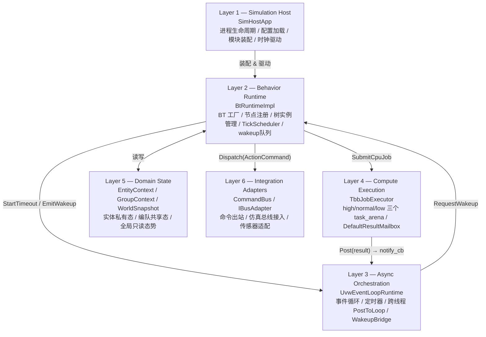
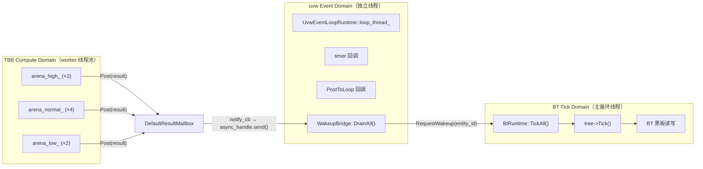
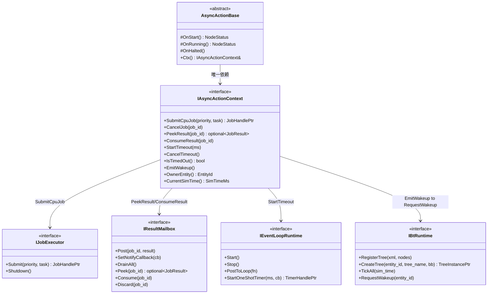
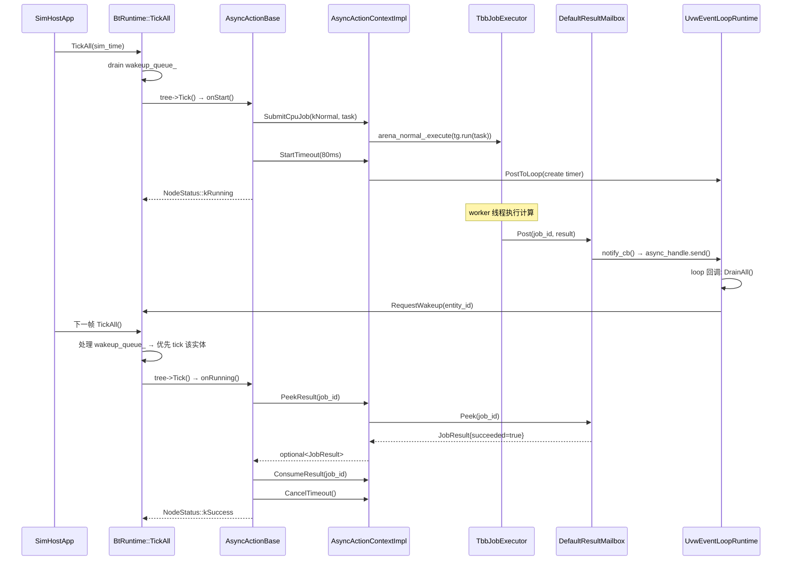
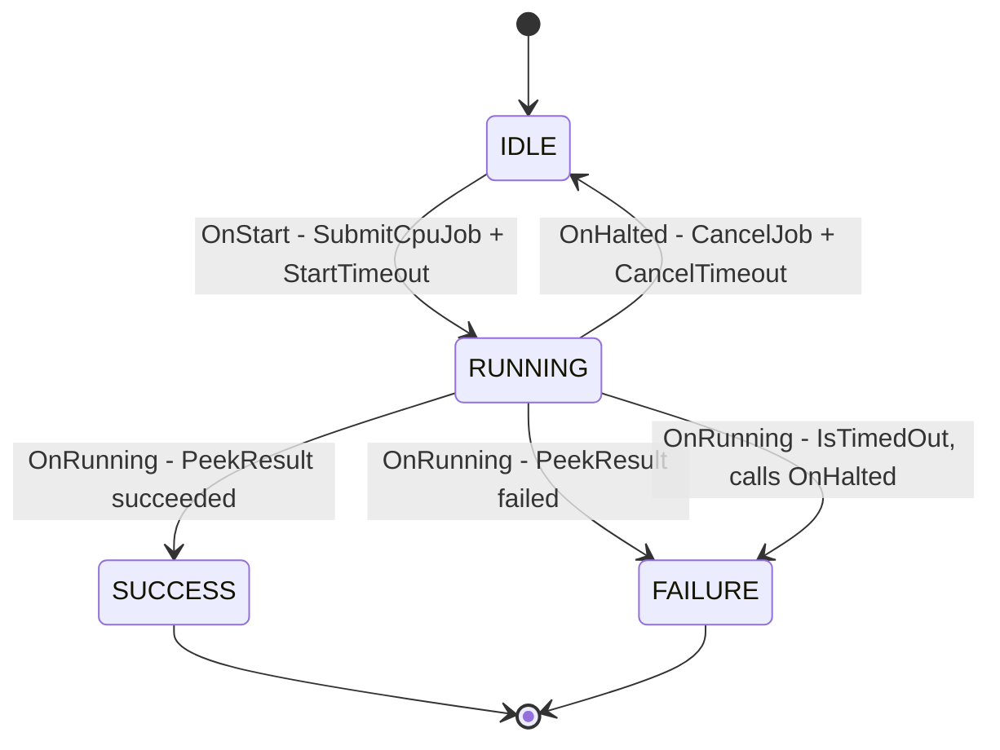
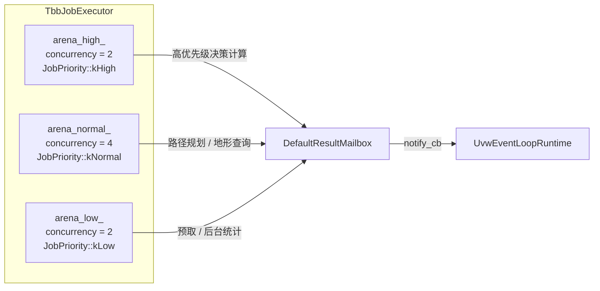
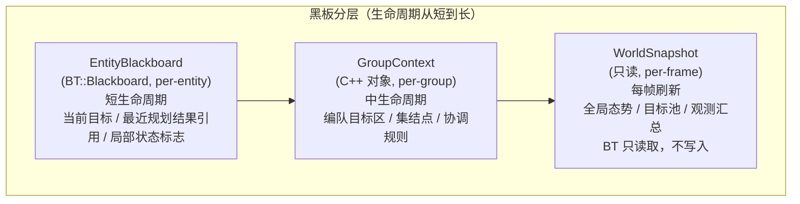
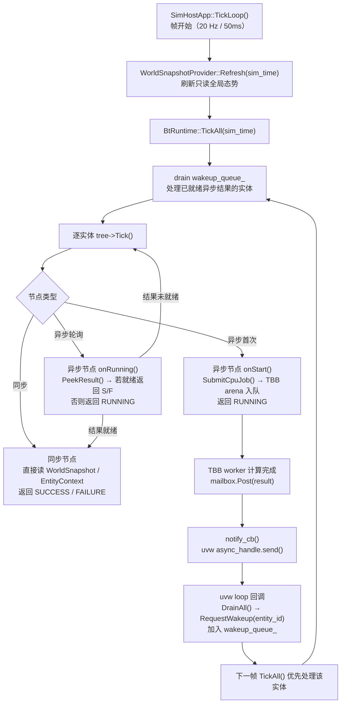

# sim-behavior 架构设计

## 1. 设计目标

- **行为树语义与执行分离**：BehaviorTree.CPP 负责"该做什么"，oneTBB 负责"谁来算"，uvw 负责"什么时候回来"
- **线程边界清晰**：三类执行域不允许跨域直接操作共享状态
- **BT 节点可单元测试**：节点只依赖接口 Facade（`IAsyncActionContext`），不直接持有 uvw/TBB 原始对象
- **跨平台 & 内网部署**：所有依赖从源码编译，zip 离线 vendor，不依赖系统安装包

---

## 2. 六层架构总览



---

## 3. 三类线程域



**跨域通信规则（强制）**：

| 来源域 | 目标域 | 允许的操作 |
|--------|--------|-----------|
| TBB Compute | Mailbox | `Post(result)` — 唯一出口 |
| Mailbox → uvw | uvw loop | `async_handle.send()` 唤醒 |
| uvw loop | BT Tick | `RequestWakeup(entity_id)` — 加入 wakeup 队列 |
| BT Tick | TBB | `SubmitCpuJob()` — 提交任务 |

**绝对禁止**：TBB worker 线程直接修改 BT 黑板、调用 `EntityContext::set*()`、调用 `BtRuntime::TickEntity()`。

---

## 4. 核心接口关系



---

## 5. 异步动作生命周期



---

## 6. 节点分类与实现策略

| 节点类型 | 场景示例 | 实现基类 | 执行域 | 备注 |
|----------|----------|----------|--------|------|
| 同步条件节点 | `HasTarget`, `CheckResource` | `BT::ConditionNode` | BT Tick | 必须微秒级完成，不走 TBB/uvw |
| 同步瞬时动作 | `SetFlag`, `ResetTimer` | `BT::SyncActionNode` | BT Tick | 同上 |
| CPU 密集异步动作 | `ComputeAction`, `EvalAction` | `AsyncActionBase` | TBB Compute | `OnStart` 提交 arena 任务 |
| I/O 等待型动作 | `WaitBusEvent`, `WaitReply` | `AsyncActionBase` | uvw Event | `OnStart` 注册 loop handle |
| 混合型（超时保护） | `ComputeWithTimeout` | `AsyncActionBase` | TBB + uvw | TBB 算，uvw 超时 |

### AsyncActionBase 回调转发



---

## 7. oneTBB Arena 配置



| Arena | `JobPriority` | 并发数 | 典型任务 |
|-------|--------------|--------|----------|
| `arena_high_` | `kHigh` | 2 | 高优先级决策计算（时延敏感） |
| `arena_normal_` | `kNormal` | 4 | 路径规划、几何计算、地形查询 |
| `arena_low_` | `kLow` | 2 | 预取、后台统计、离线缓存 |

> **注意**：`reserved_for_masters` 不要配置过高，否则 `enqueue()` 的调度保证会失效（oneTBB 官方文档警告）。

---

## 8. 黑板分层设计



---

## 9. 标准帧数据流



---

## 10. 目录结构与模块职责

```
sim-behavior/
├── cmake/
│   ├── CompilerFlags.cmake       跨平台编译标志（MSVC / GCC / Clang）
│   └── Dependencies.cmake        三级依赖引入（目录 → zip → FetchContent）
│
├── include/sim_bt/               公开接口（纯虚类，无实现细节）
│   ├── common/
│   │   ├── types.hpp             EntityId, SimTimeMs, JobPriority 等基础类型
│   │   └── result.hpp            JobResult, NodeStatus 值语义结构体
│   ├── runtime/
│   │   ├── bt_runtime/           IBtRuntime, ITreeInstance
│   │   ├── async_runtime/        IEventLoopRuntime, IWakeupBridge, IBusAdapter
│   │   └── compute_runtime/      IJobExecutor, IJobHandle, IResultMailbox, ICancellationToken
│   ├── domain/
│   │   ├── entity/               IEntityContext
│   │   ├── group/                IGroupContext
│   │   └── world/                IWorldSnapshot
│   ├── adapters/                 ICommandBus
│   └── bt_nodes/
│       ├── i_async_action_context.hpp   BT 节点唯一运行时 Facade
│       └── async_action_base.hpp        所有异步节点的基类
│
├── src/                          具体实现（不对外暴露）
│   ├── runtime/
│   │   ├── compute_runtime/      TbbJobExecutor, TbbJobHandle, DefaultResultMailbox
│   │   ├── async_runtime/        UvwEventLoopRuntime, UvwTimerHandle, UvwWakeupBridge
│   │   └── bt_runtime/           BtRuntimeImpl, AsyncActionContextImpl, TreeInstanceImpl
│   ├── domain/
│   │   ├── entity/               EntityContextImpl
│   │   ├── group/                GroupContextImpl
│   │   └── world/                WorldSnapshotImpl, WorldSnapshotProviderImpl
│   ├── adapters/                 InProcessCommandBus
│   ├── bt_nodes/                 AsyncActionBase 实现
│   └── sim_host/                 SimHostApp + main.cpp（进程入口）
│
├── tests/                        GoogleTest 测试套件
│   ├── test_cancellation_token.cpp          # ICancellationToken 单元测试
│   ├── test_result_mailbox.cpp              # IResultMailbox 单元测试
│   ├── test_entity_context.cpp              # IEntityContext 单元测试
│   ├── test_async_action_base.cpp           # AsyncActionBase 单元测试
│   └── test_cross_library_integration.cpp  # 跨库边界集成测试（TBB↔Mailbox↔uvw）
│
├── scripts/
│   └── vendor-deps.sh            联网机器一键下载所有 zip 依赖
│
├── third_party/
│   ├── corekit/                  git submodule（必须，含 GlobalAllocator 等）
│   ├── oneTBB.zip                ← scripts/vendor-deps.sh 生成
│   ├── libuv.zip
│   ├── uvw.zip
│   ├── BehaviorTree.CPP.zip
│   └── googletest.zip
│
└── docs/design/
    ├── architecture.md           本文档
    └── behaviorTree+onetbb+uvw.md 原始设计文档
```

---

## 11. 依赖版本锁定

| 依赖 | 版本 | CMake 目标 | zip 来源 |
|------|------|-----------|---------|
| corekit | main (submodule) | `corekit` | git submodule 必须 |
| oneTBB | v2022.0.0 | `TBB::tbb` | [GitHub](https://github.com/oneapi-src/oneTBB/archive/refs/tags/v2022.0.0.zip) |
| libuv | v1.48.0 | `uv::uv` | [GitHub](https://github.com/libuv/libuv/archive/refs/tags/v1.48.0.zip) |
| uvw | v3.4.0_libuv_v1.48 | `uvw::uvw` | [GitHub](https://github.com/skypjack/uvw/archive/refs/tags/v3.4.0_libuv_v1.48.zip) |
| BehaviorTree.CPP | 4.9.0 | `BT::behaviortree_cpp` | [GitHub](https://github.com/BehaviorTree/BehaviorTree.CPP/archive/refs/tags/4.9.0.zip) |
| GoogleTest | v1.16.0 | `GTest::gtest` | [GitHub](https://github.com/google/googletest/archive/refs/tags/v1.16.0.zip) |

CMake 最低版本：**3.24** | C++ 标准：**C++17**

---

## 12. 开发阶段路线图

### Phase 1 — 最小闭环（当前）

目标：单实体、单树、一个 CPU 异步节点跑通完整链路。

- [ ] `ComputeAction::OnStart()` 提交 TBB 任务
- [ ] TBB worker 写入 `ResultMailbox`
- [ ] uvw `async_handle` 唤醒 BT re-tick
- [ ] `OnRunning()` 消费结果，返回 `SUCCESS`
- [ ] `OnHalted()` 取消任务，令牌生效

### Phase 2 — 实体级运行时

- [ ] `EntityContext` + `WorldSnapshot` 完整集成
- [ ] 多实体并行 tick（同一线程，串行）
- [ ] 编队协调（`GroupContext` 共享）

### Phase 3 — 总线接入

- [ ] uvw TCP/UDP `BusAdapter`
- [ ] `CommandBus` 接仿真宿主

### Phase 4 — 性能治理

- [ ] 多 arena 优先级验证
- [ ] 实体分组批量 tick
- [ ] 每帧 tick 耗时采样
- [ ] `TraceLogger`（节点状态迁移日志）
